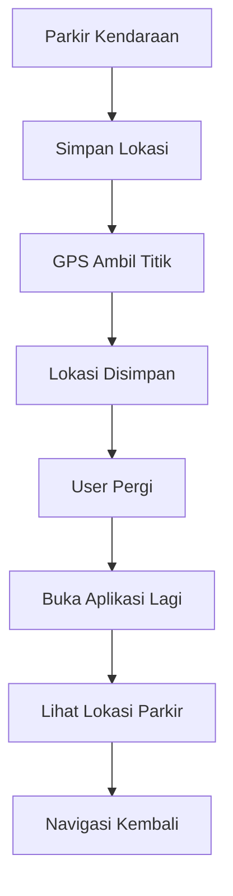

# Parkir-In

  

  <b>Save your parking spot. Find it faster.</b>

  
  
  
  
  

---

## Tentang Parkir-In

**Parkir-In** adalah aplikasi mobile berbasis Flutter yang membantu pengguna menyimpan lokasi parkir kendaraan dan menemukannya kembali dengan mudah.

Aplikasi ini dibuat berdasarkan masalah nyata yang sering terjadi: pengguna lupa lokasi parkir karena area terlalu luas, kendaraan terlalu banyak, atau tidak ada penanda khusus.

Dengan memanfaatkan GPS dan peta digital, Parkir-In membuat proses menyimpan dan mencari kendaraan jadi lebih cepat, praktis, dan efisien.

---

## - Problem Solving

Masalah yang sering terjadi:

- Lupa parkir kendaraan  
- Area parkir terlalu luas  
- Banyak kendaraan serupa  
- Sulit mengingat posisi terakhir  

Solusi dari Parkir-In:

- Simpan lokasi parkir instan  
- Navigasi kembali ke kendaraan  
- Marker lokasi parkir di map  
- Detail lokasi tersimpan  

---

## - Fitur Utama

## Save Parking Spot
Menyimpan lokasi parkir secara real-time menggunakan GPS.

**Fitur:**
- Ambil koordinat otomatis
- Simpan titik lokasi
- Marker otomatis pada map

---

## - Interactive Map
Menampilkan lokasi parkir secara visual pada peta.

**Fitur:**
- Marker lokasi parkir
- Posisi user saat ini
- Tampilan area sekitar

---

## - Navigate Back
Navigasi menuju lokasi kendaraan.

**Fitur:**
- Menampilkan rute
- Menunjukkan arah kembali
- Tracking posisi user

---

## - Parking Details
Menyimpan informasi tambahan mengenai lokasi parkir.

**Data yang disimpan:**
- Nama lokasi
- Koordinat
- Timestamp parkir
- Catatan tambahan

---

## - Cara Kerja Aplikasi

---

## - Tech Stack

| Bagian | Teknologi |
|---|---|
| Frontend | Flutter |
| Language | Dart |
| Maps | Google Maps API |
| Location | Geolocator |
| Storage | SharedPreferences |
| State Management | Provider |

---

## - Preview Aplikasi

## Home Screen

  

---

## Map Screen

  

---

## Detail Screen

  

---

## - Tujuan Aplikasi

- Membantu pengguna menemukan kendaraan lebih cepat
- Mengurangi waktu pencarian kendaraan
- Menyimpan lokasi parkir dengan akurat
- Memberikan navigasi kembali ke lokasi parkir

---

## - Future Development

- Parking history
- Favorite parking spots
- Parking reminder
- Upload foto lokasi parkir
- Multi-vehicle support

---

## Developer

**Danur Wenda Prasetiyo**  
Teknik Informatika

---

## Support

Jika project ini membantu, jangan lupa kasih **star** ⭐

---

## License

noers@2026
