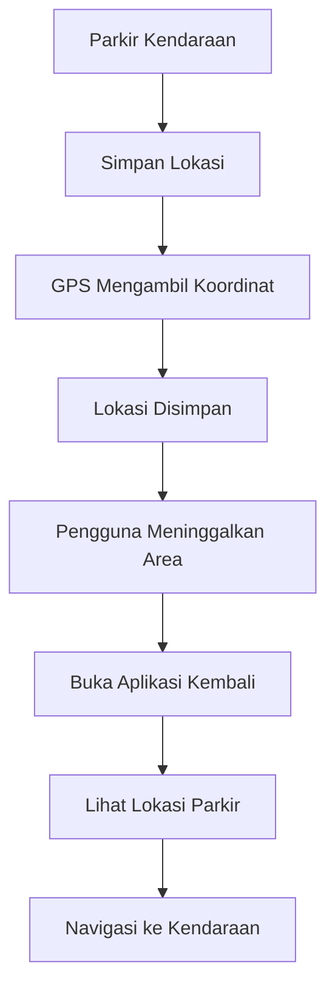
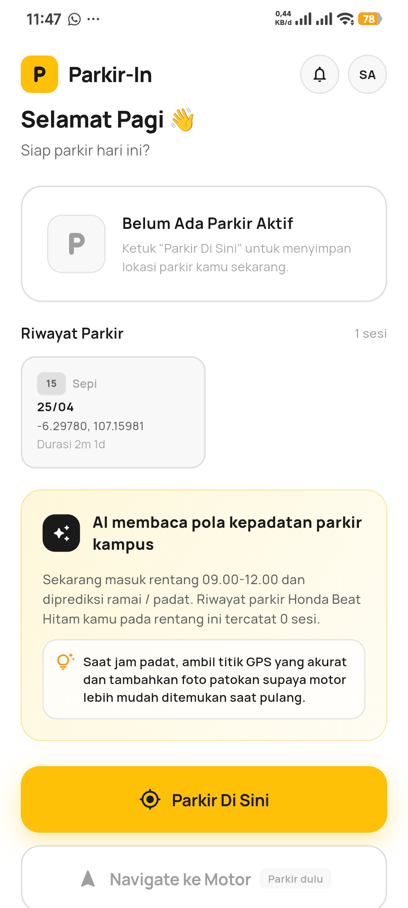
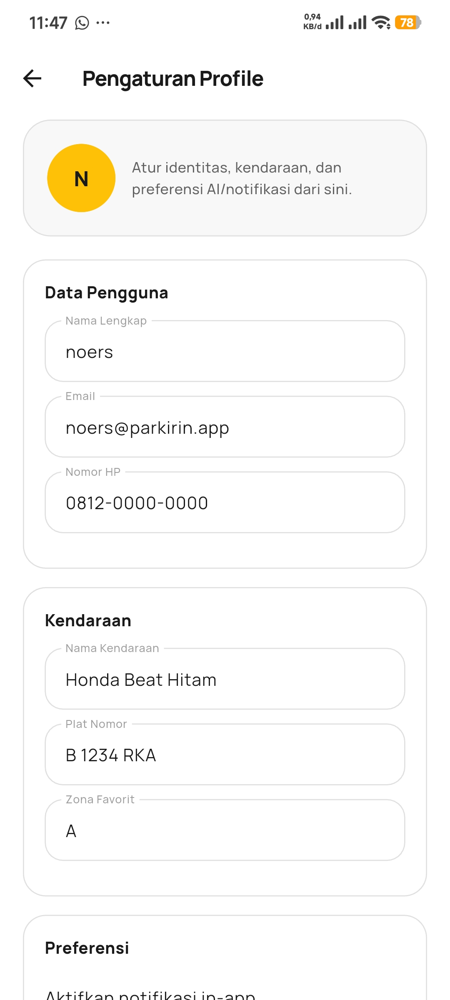
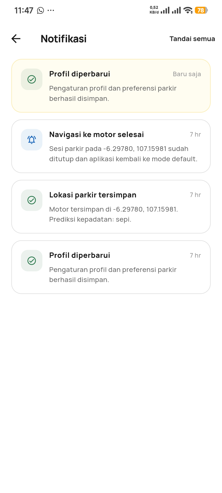
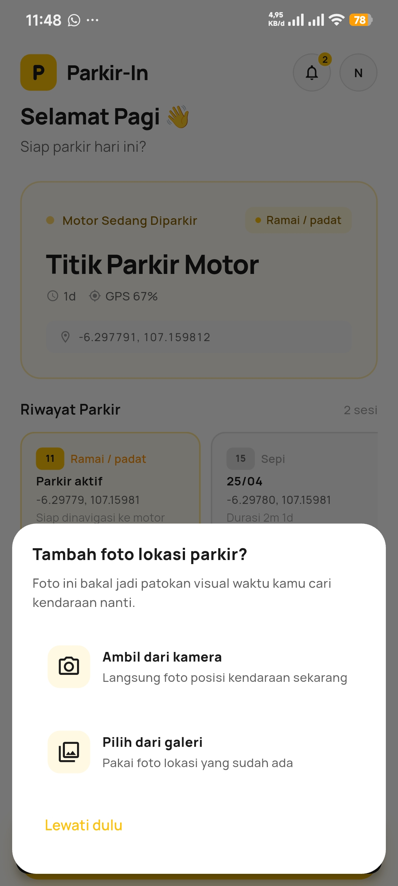
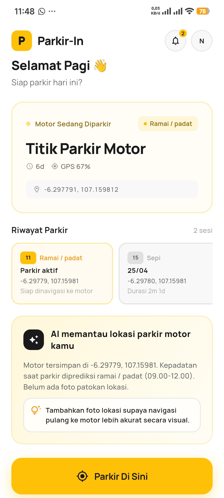
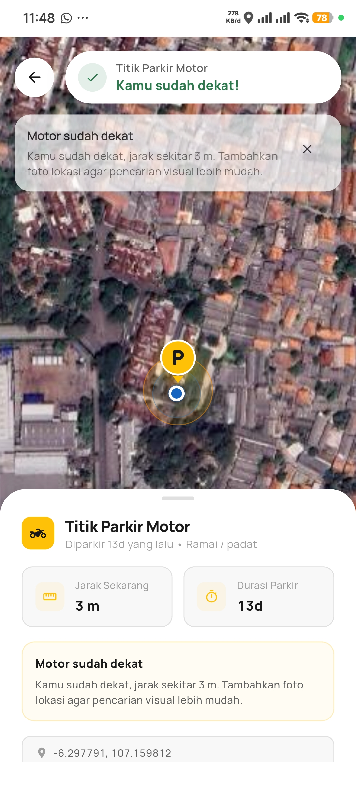

# Parkir-In

  <b>Simpan lokasi parkir. Temukan kendaraan lebih cepat.</b>

  
  
  
  
  

---

## 📌 Tentang Parkir-In

**Parkir-In** adalah aplikasi mobile berbasis Flutter yang dirancang untuk membantu pengguna menyimpan lokasi parkir kendaraan dan menemukannya kembali dengan mudah.

Aplikasi ini dibuat untuk menyelesaikan masalah yang sering dialami banyak orang, yaitu lupa lokasi parkir kendaraan, terutama di area parkir yang luas, padat, atau ramai.

Dengan memanfaatkan GPS dan peta digital, Parkir-In membantu pengguna melacak lokasi parkir dengan lebih cepat, praktis, dan efisien.

---

## 🎯 Permasalahan yang Diselesaikan

Masalah yang sering terjadi:

* Lupa lokasi parkir kendaraan
* Area parkir terlalu luas
* Banyak kendaraan yang mirip
* Sulit mengingat posisi parkir terakhir

Solusi dari Parkir-In:

* Menyimpan lokasi parkir secara instan
* Navigasi kembali ke kendaraan
* Penanda lokasi parkir di peta
* Penyimpanan detail parkir

---

## ✨ Fitur Utama

### 📍 Simpan Lokasi Parkir

Menyimpan lokasi parkir secara real-time menggunakan GPS.

Fitur:

* Deteksi koordinat otomatis
* Menyimpan titik parkir
* Menampilkan marker pada peta

---

### 🗺️ Peta Interaktif

Menampilkan lokasi parkir secara visual pada peta.

Fitur:

* Marker lokasi parkir
* Lokasi pengguna saat ini
* Tampilan area sekitar

---

### 🧭 Navigasi Kembali

Membantu pengguna kembali ke lokasi kendaraan.

Fitur:

* Menampilkan rute perjalanan
* Panduan arah menuju kendaraan
* Tracking lokasi pengguna

---

### 📝 Detail Parkir

Menyimpan informasi tambahan terkait lokasi parkir.

Data yang disimpan:

* Nama lokasi
* Koordinat
* Waktu parkir
* Catatan tambahan

---

### 📷 Ambil Foto Lokasi

Mengambil foto area parkir untuk memudahkan identifikasi.

Fitur:

* Foto lokasi parkir
* Membantu mengingat kondisi sekitar

---

### 🔔 Notifikasi

Memberikan pengingat terkait aktivitas parkir.

Fitur:

* Notifikasi status parkir
* Pengingat parkir

---

## ⚙️ Cara Kerja Aplikasi

---

## 🛠️ Teknologi yang Digunakan

| Komponen           | Teknologi         |
| ------------------ | ----------------- |
| Frontend           | Flutter           |
| Bahasa Pemrograman | Dart              |
| Integrasi Peta     | Google Maps API   |
| Layanan Lokasi     | Geolocator        |
| Penyimpanan Lokal  | SharedPreferences |
| State Management   | Provider          |

---

## 📱 Tampilan Aplikasi

### Home Screen

  

---

### Profile Screen

  

---

### Notification Screen

  

---

### Take Photo Screen

  

---

### Parking Saved Screen

  

---

### Navigation Screen

  

---

## 📦 Download Aplikasi

  

---

## 🎯 Tujuan Aplikasi

* Membantu pengguna menemukan kendaraan lebih cepat
* Mengurangi waktu pencarian kendaraan
* Menyimpan lokasi parkir dengan akurat
* Memberikan navigasi kembali ke lokasi parkir

---

## 🚀 Pengembangan Selanjutnya

* Riwayat parkir
* Lokasi parkir favorit
* Pengingat parkir otomatis
* Dukungan banyak kendaraan
* Backup data ke cloud

---

## 👨‍💻 Developer

**Danur Wenda Prasetiyo**
Mahasiswa Teknik Informatika

---

## ⭐ Dukungan

Jika project ini bermanfaat, jangan lupa kasih **star** ⭐

---

## 🌐 Hubungi Saya

  

  

  

